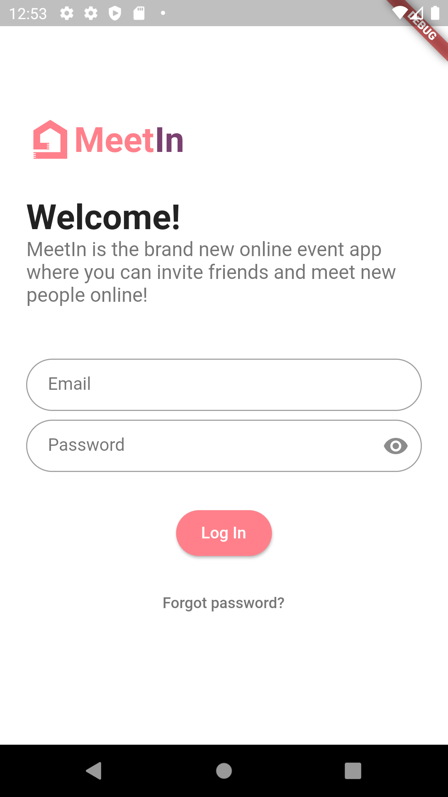
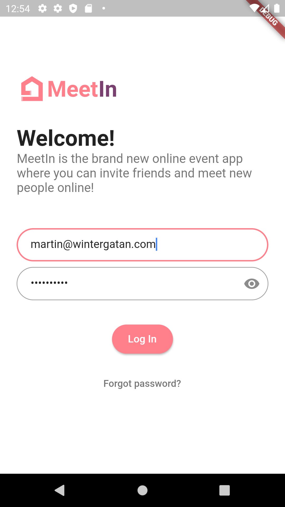
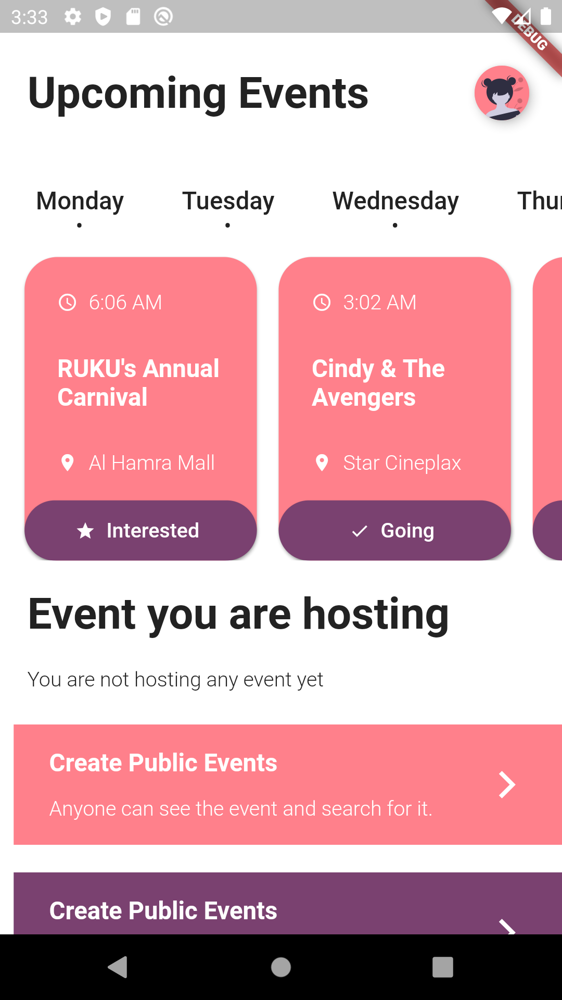
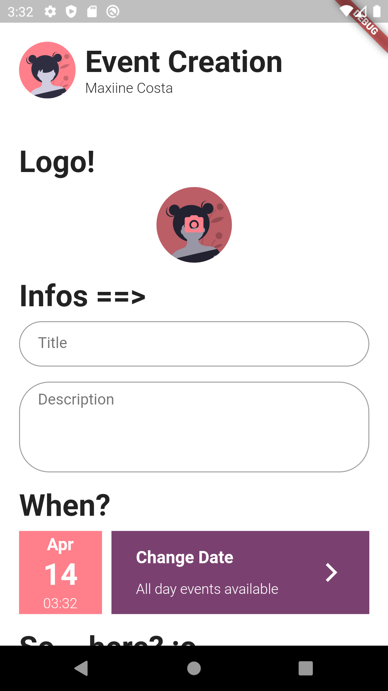
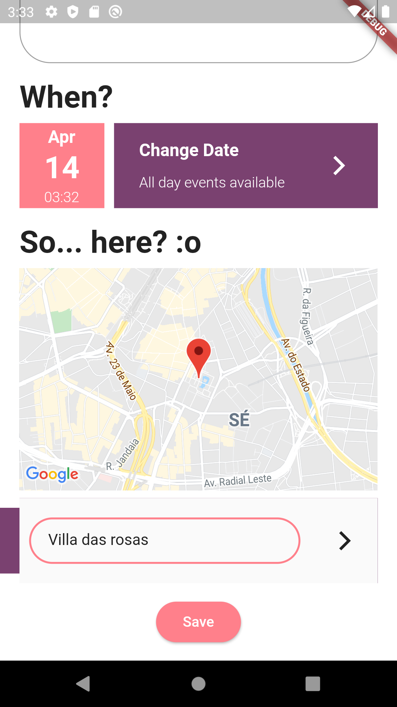

# MeetIn

This is my event app where i try to test all native capabilities of flutter while learning it by myself.
In the final version will be possible to create and join and view history of past events.

The app has a simple login and simple info cards so everything is easy to access

# Design
Since I'm not a designer and this project will not be a commercial piece I used some designs and will credit them here:

Dashboard by Shafi https://dribbble.com/shots/6403899-Events-Management-App

Login by Putraxor https://github.com/putraxor/flutter-login-ui

Login                      | Filled Login               | Dashboard                 | Event Creation            | Event Creation 2
:-------------------------:|:--------------------------:|:-------------------------:|:-------------------------:|:-------------------------:
  |   |  |  | 

## WIP
## Building

Before building the app, api keys need to be applied with `dart pre-build.dart` you will need a google api key (google maps + places api) the script can be seen [here](./pre-build.dart)

## Native functionalities i want to test

- [x] geo
- [x] camera
- [ ] notifications
- [ ] phone info (battery, number etc)
- [x] file
- [ ] in-app-browser
- [ ] network information

## File Distribution

- utils: small files for constant info: keys, colors, etc
- pages: actual app activities
- entities: type declaration for objects to be used in the app
- components: complex widgets that will be used more than once in the app
